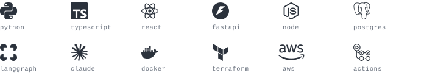

## Harishraj Udaya Bhaskar

**Applied AI / LLM Infrastructure Engineer** in Los Angeles.

I build the layer between language models and the systems a business actually runs on: tool calling that reaches live data, retrieval that stays grounded, and the platform underneath it.

Currently at CustomStacks, putting agent systems into customer environments and keeping them running.

### Skills

<picture>
  <source media="(prefers-color-scheme: dark)" srcset="assets/skills-dark.svg">
  <source media="(prefers-color-scheme: light)" srcset="assets/skills-light.svg">
  
</picture>

### Worth a look

**[ProofreadAnywhere](https://github.com/hatish2001/ProofreadAnywhere)** puts Apple Intelligence proofreading in any macOS app behind one hotkey, running on the local model so nothing leaves the machine.

**[meetingmind](https://github.com/hatish2001/meetingmind)** records, transcribes and summarizes meetings, then answers questions about them. Self hosted.

**[DevContext](https://github.com/hatish2001/DevContext)** pulls Slack, JIRA and GitHub into one view, so you stop losing half an hour a day to tab switching.

**[browser-navigator](https://github.com/hatish2001/browser-navigator)** drives headless Chrome from Python through a small deterministic API, built for an agent to call rather than a person to click.

[LinkedIn](https://linkedin.com/in/uharishraj) &nbsp;&middot;&nbsp; [hello@uharishraj.com](mailto:hello@uharishraj.com)
